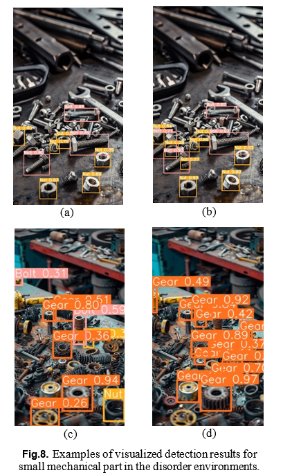
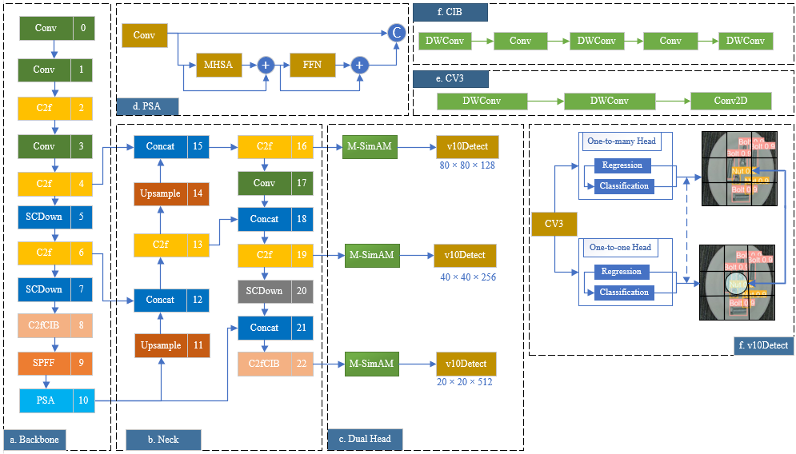
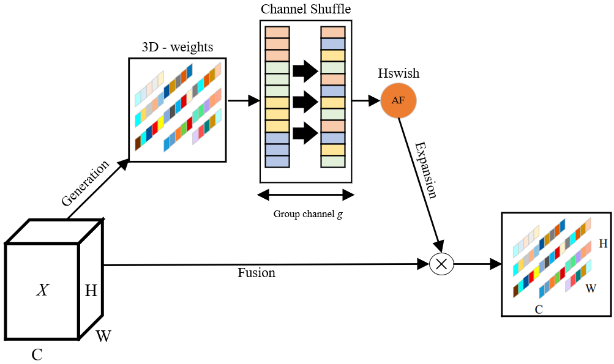
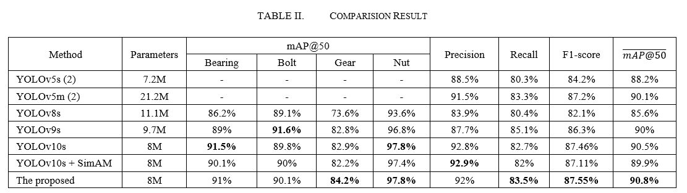

# Mechanical Part Detection Using Improved YOLOv10 (Status: Submission)

2024 International Conference on Control, Automation and Information Sciences

  

## Introduction

 
	Mechanical object detection has recently become one of the crucial parts of the industry. The merge of deep learning offers a method to detect these objects. However, the small size of mechanical objects faces a challenge of achieving high average precision. To address this issue, this paper presents an improved YOLOv10 model for mechanical part detection. A modified simple, parameter-free attention module (SimAM) is proposed to integrate into the Head component of YOLOv10 to extract the significant features for feature maps. The SimAM generates 3D weights for attention to improve the performance of small-size object detection. The proposed method is trained with the Mechanical Parts Computer Vision Project dataset and achieves a mean Average Precision (mAP) at IoU threshold 50 scores of 90.8%. The experiment result showed that the accuracy of the proposed method surpasses the original YOLOv5 by 2.6%.

## Proposed Yolov10 's Architecture

 

## Proposed M-SimAM Architecture with fine-tunning AND choose H-swish activation function

## Mechanical Parts Computer Vision Project  Dataset

In our experiment, we used dataset **Mechanical Parts Computer Vision Project**, which contains 2250 images, and 4 categorizes.

The dataset is open for free use, raw data download at (https://universe.roboflow.com/mazhar-cakir/mechanical-parts)

## Results

- **Mechanical Part Detection Using Improved YOLOv10.**

 

Figure: Comparision Results.

## Citation
	
`T. Q. Vinh and P. H. Long `

